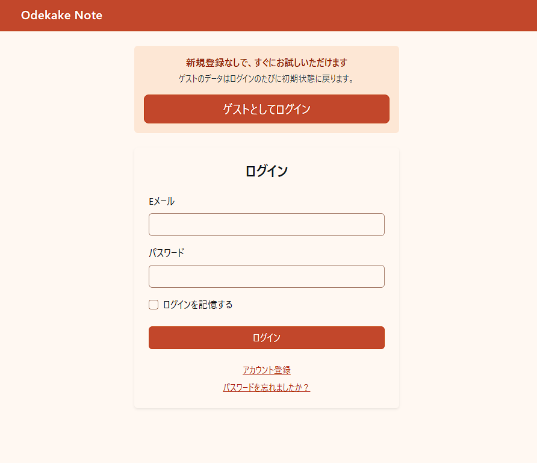
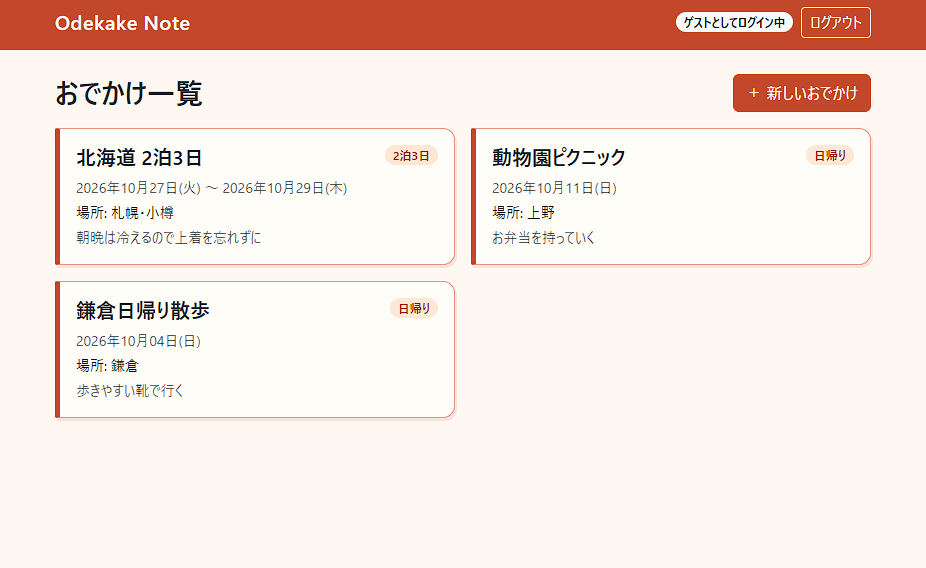
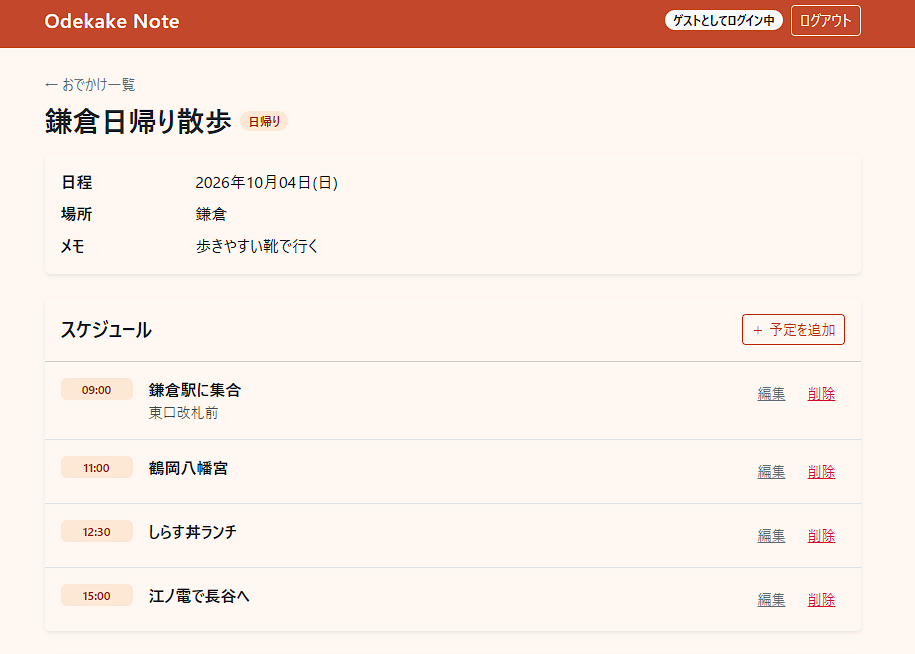
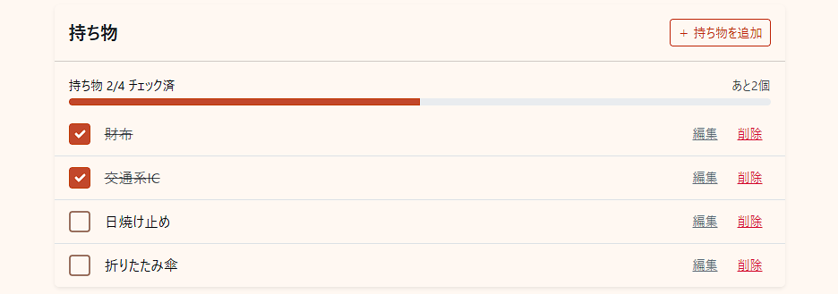
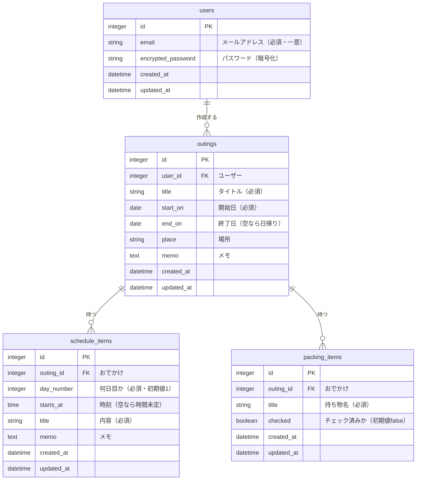

# おでかけノート（odekake_note）

おでかけの予定・スケジュール・持ち物リストを、ひとつにまとめて管理できるアプリです。

🔗 **アプリURL：https://odekake-note.onrender.com**

> ※ 無料プランで公開しているため、しばらくアクセスがないとスリープします。初回アクセス時は表示まで数十秒かかることがあります。
> ※ 「ゲストとしてログイン」ボタンから、ユーザー登録なしですぐに試せます。

---

## アプリのスクショ

| ログイン画面 | おでかけ一覧 |
|:---:|:---:|
|  |  |
| **おでかけ詳細（スケジュール）** | **持ち物チェックリスト** |
|  |  |

---

## アプリの使い方

### 1. ログインする

- **ゲストログイン（おすすめ）**：ログイン画面の「ゲストとしてログイン」ボタンを押すと、登録なしで使えます。
  - サンプルのおでかけが3件入った状態から始まります。
  - ゲストログインするたびにサンプルデータが初期状態に戻るので、自由に追加・編集・削除して試せます。
  - ゲストユーザーは共用アカウントのため、メールアドレス・パスワードの変更と退会はできません。
- **新規登録**：メールアドレスとパスワードで登録すると、自分だけのおでかけを保存できます。

### 2. おでかけを登録する

一覧画面の「＋ 新しいおでかけ」から、タイトル・日程・場所・メモを入力します。

- 日帰りの場合は、終了日を空欄のままにします。
- 一覧では、開始日の新しい順にカードで表示されます。

### 3. スケジュールを追加する

おでかけの詳細画面から、「何日目か」「時刻」「内容」を入力して予定を追加します。

- 予定は日ごとに、時刻順で自動的に並びます。
- 時刻を空欄にした予定（時間未定）は、その日の最後に表示されます。

### 4. 持ち物をチェックする

おでかけの詳細画面から持ち物を追加し、準備できたものにチェックを付けます。

- チェックを付けると、ページを再読み込みせずにその場で表示が切り替わります。
- 「持ち物 ◯/◯ チェック済」の集計と進み具合のバーも、あわせて自動で更新されます。

---

## なぜこれを作ったか

普段からスケジュールアプリを使っているのですが、おでかけの予定と持ち物リストが別々のアプリになってしまい、行き来するのが面倒でした。

「おでかけの予定と持ち物を、1つの画面でサクッと見られるアプリがあればいいな」と思ったのが、開発のきっかけです。

---

## 工夫したところ

### 1. 他人のデータを守る仕組み

URLのIDを書き換えるだけで他人のデータが見えてしまうことがないよう、データの取得は必ず **ログイン中のユーザー自身のデータ** から行っています。

```ruby
# app/controllers/packing_items_controller.rb
def set_outing
  @outing = current_user.outings.find(params.expect(:outing_id))
end

def set_packing_item
  @packing_item = @outing.packing_items.find(params.expect(:id))
end
```

- `Outing.find(id)` ではなく `current_user.outings.find(id)` とすることで、他人のおでかけは「存在しない」扱い（404）になります。
- スケジュール・持ち物も「自分のおでかけ → その中の予定・持ち物」の順にたどるので、他人のおでかけの予定や、別のおでかけの持ち物にもアクセスできません。
- フォームから `user_id` を送り込まれても、他人のおでかけとして登録されないようにしています。
- 表示・編集・更新・削除のそれぞれで、他人のデータに 404 が返ることをテストで確認しています。

### 2. Turbo Stream でのチェック機能

持ち物のチェックは、**ページ全体を再読み込みせずに、変わった部分だけを差し替える** ようにしました。

```erb
<%# app/views/packing_items/toggle.turbo_stream.erb %>
<%= turbo_stream.replace @packing_item, partial: "packing_items/item",
      locals: { outing: @outing, packing_item: @packing_item } %>
<%= turbo_stream.replace "packing_items_summary", partial: "packing_items/summary",
      locals: { outing: @outing } %>
```

- チェックした持ち物の行と、「持ち物 ◯/◯ チェック済」の集計（進み具合のバー・残りの個数）の2か所だけを更新します。
- 画面のスクロール位置が変わらないので、持ち物が多くてもテンポよくチェックできます。
- JavaScript が使えない環境などで Turbo を通らない送信になった場合は、通常のリダイレクトで同じ結果になるようにしています。

### 3. タイムゾーンのバグを見つけて直したこと

スケジュールを時刻順に並べる機能を作ったとき、**朝早い予定（例：08:00）が、その日の一番最後に表示される** というバグに気づきました。

- **原因**：Rails はタイムゾーンを日本時間（Tokyo）に設定すると、時刻を UTC（日本時間 − 9時間）に変換してDBに保存します。
  そのため `08:00` は `前日の23:00`、`10:00` は `01:00` として保存され、DB上で並べ替えると順番が逆転していました。
- **修正**：予定の「時刻」は日付を持たない時間なので、タイムゾーンで変換する必要はありません。
  そこで、変換の対象を日時（`datetime`）型だけに限定し、時刻（`time`）型は入力したまま保存するようにしました。

```ruby
# config/application.rb
config.time_zone = "Tokyo"

# time 型（予定の時刻）はタイムゾーン変換しない。UTC に変換されると、
# 日本時間で9時前の時刻がDB上で後ろに並んでしまうため
config.active_record.time_zone_aware_types = [ :datetime ]
```

- 並び順（日ごと → 時刻順 → 時間未定は最後）はテストでも確認しています。

### 4. Bootstrap での見た目の作り込み

Bootstrap をベースにしつつ、「おでかけノート」らしい、やわらかい雰囲気になるよう調整しました。

- **付箋風のカード**：一覧のカードは、左側に太い色帯を付けた付箋のようなデザインにしました。マウスを乗せると少し浮き上がります。カード全体がリンクになっているので、どこを押しても詳細画面に移動できます。
- **入力エラーの表示**：Rails 標準のエラー表示（入力欄が `div` で囲まれてレイアウトが崩れる）を、Bootstrap の赤枠表示（`is-invalid`）に置き換えました（`config/initializers/field_error_proc.rb`）。
- **ログイン画面の統一**：Devise のログイン・新規登録・パスワード再設定画面も日本語化し、アプリ全体と同じデザインにそろえました。
- **スケジュールの見やすさ**：時刻のバッジの幅をそろえて、予定のタイトルの開始位置が縦にそろうようにしました。

### その他

- **ゲストのサンプルデータ**：サンプルのおでかけの日付は「ログインした日から◯日後」で作っているので、いつ試しても“これからのおでかけ”として表示されます。
- **本番環境のDB**：開発環境は手軽な SQLite、本番環境（Render）はデータが消えない PostgreSQL と、環境ごとにデータベースを切り替えています。

---

## ER図



- ユーザーを削除すると、そのユーザーのおでかけも削除されます。
- おでかけを削除すると、その中のスケジュール・持ち物も削除されます。

---

## 使用技術

| 分類 | 技術 |
|---|---|
| 言語・フレームワーク | Ruby 3.3 / Ruby on Rails 8.1 |
| 認証 | Devise |
| フロントエンド | Hotwire（Turbo / Stimulus）、Bootstrap 5 |
| データベース | 開発：SQLite / 本番：PostgreSQL |
| テスト | Minitest |
| デプロイ | Render |

---

## ローカルでの起動方法

```bash
git clone https://github.com/HB0723/odekake_note.git
cd odekake_note
bin/setup    # gemのインストール・DBの作成・サーバー起動
```

ブラウザで http://localhost:3000 を開きます。

テストの実行：

```bash
bin/rails test
```
